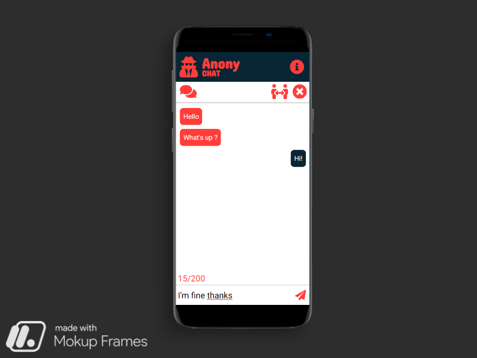

<h4 align="center">The application to talk to strangers</h4>
<p align="center">
  <a >
    
  </a>
</p>

## Project Overview 
Anonychat is an application developed in React, used to chat with a randomly selected person. On the main page, just click the button and if you are currently logged in, you will be connected to one. All user actions are sent to the server, which responds to them using the SocketIO library, which allows real-time communication. Redux is responsible for the application status.


## Tech/framework used 

| Tech                                                    | Description                              |
| ------------------------------------------------------- | ---------------------------------------- |
|React                         | The library for building user interfaces  |
|React hooks                          | New addition in React 16.8. allowing to use the state without using classes   |
|React router                         |Declarative routing for React   |
|Redux                          | The library for state management applications|
|Socket.io-client               | JavaScript library for web applications in real time.   |


## Live 
https://anooonychat.netlify.app/


## Server 
https://github.com/MaciejSpalek/Chat-server

## Installation 

```
git clone https://github.com/MaciejSpalek/ChatWithStrangers.git

npm install

npm run start
```
